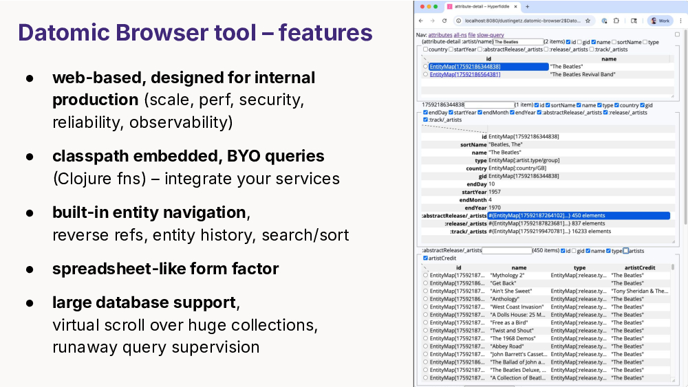
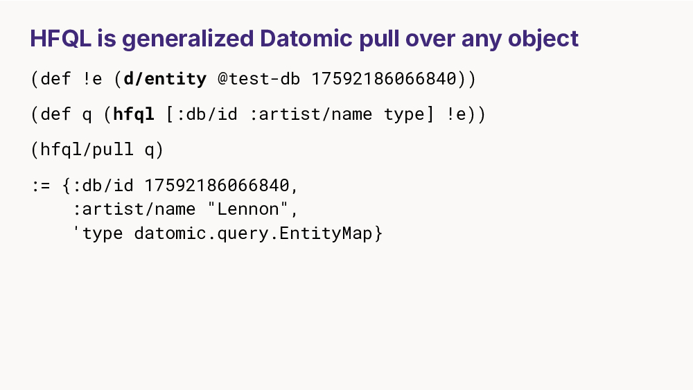
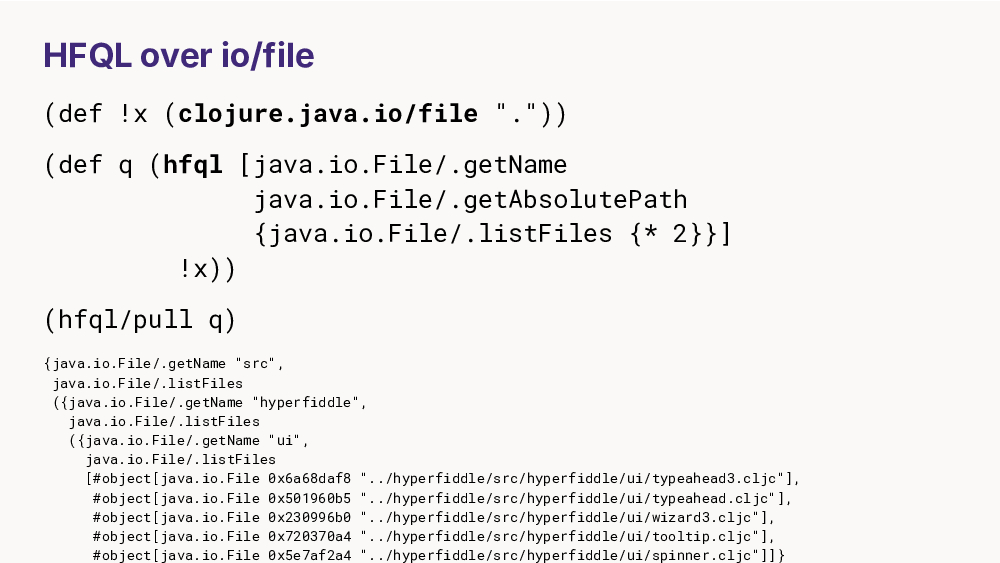
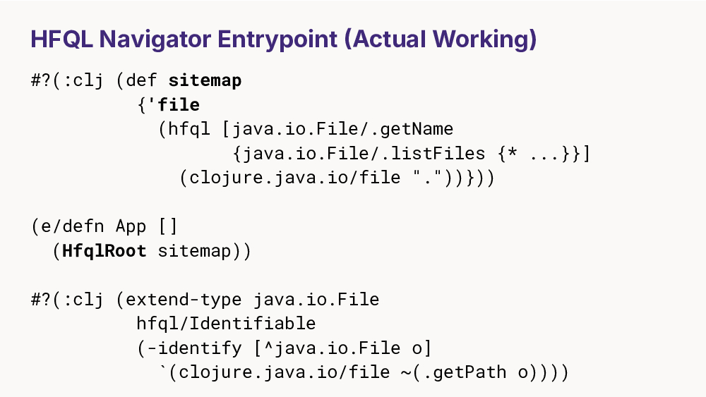
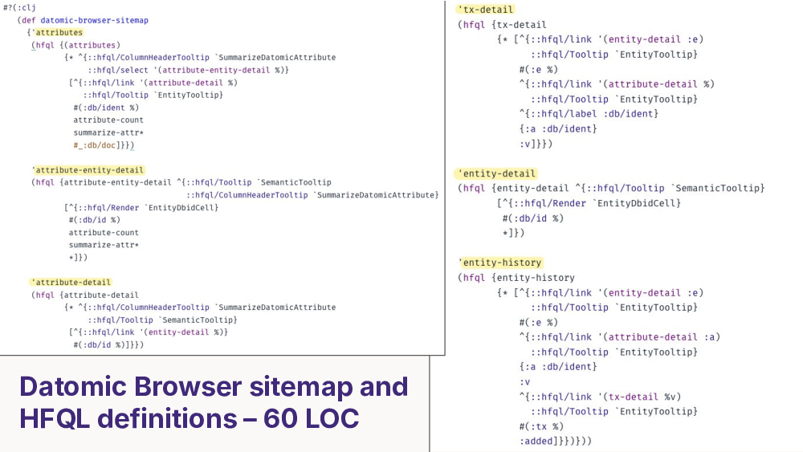

# A Datomic entity browser for prod

* **Speaker: Dustin Getz**
* **Conference: [Clojure/Conj 2025](https://www.2025.clojure-conj.org/)**
* **Date: 13 November 2025**
* **Video: [https://www.youtube.com/watch?v=dmucZkE5gd0](https://www.youtube.com/watch?v=dmucZkE5gd0)**

00:00:08

All right. What I'm about to show you is a very cool web development demo. So, don't look down. If you blink, you'll miss it. 

I'm Dustin Getz. I work on Electric Clojure. This is a Datomic browser tool that we've built in Electric. What we're going to do is give you a quick demo of the tool, but also we're going to talk about how it works and the programming model, how you can customize it with your own queries and how you can use it with any backend or database -- not just Datomic.

So what are we looking at? This is basically a programmable spreadsheet that is targeting Datomic. Since we're starting with the Datomic schema here, each row of this table is a Datomic schema attribute. And this is the musicbrainz full data set which is a music catalog. So let's try to find the Beatles. Now, to do that, since it's a spreadsheet, sorting and filtering is built in. So, I'm going to try to filter my schema attributes to find the artist name. Here it is. And note, there are 664,000 artists in this database. So, this is a large database.

Let's click through and see all those artists. I'm going to add some columns. Now, see how they stream in from the background as I click them. That's Electric Clojure doing its thing. Electric Clojure is a web framework that uses macros to compile across the front-end/back-end boundary. So as you can see Electric does a really good job at this all IO streaming virtual scroll over thousands of records. It's all managed by Electric.

So we're looking for the Beatles. Now remember this query had 600,000 records in it. So it's not a naive search. We've taken great care with this tool to make sure it doesn't blow up on large real world databases. So, I click on the link. I take us to this nice entity view. Let's look for the song Yellow Submarine. And that in the musicbrainz data model is a release. So, here is the release attribute. And it's actually a reverse attribute. This underscore, if you know Datomic, is a Datomic reverse reference. So no problem. That's fine. And I'm going to select the cell. So you get this spreadsheet-like relational navigation experience and you can wander the graph. Let me clean up the columns and let's try to find Yellow Submarine. Oops. Yellow Submarine. And there are 20 tracks, so this is a popular track. Let's wander a little further. Yellow Submarine. Here's that artist reference in the forward direction this time. It's `cardality/many` and here's the one element in the cardality-many set and sure enough it's the Beatles. So you get the point.

00:02:52 It's all URL addressable so I can refresh the page and the selection state will come back intact. Back button works. I'm going to middle click this link so middle click works. We don't break the web. [applause]

00:03:07 Let's take a look at this URL. You can't see it, but it's actually repeated here. So, we're encoding S-expressions into the URL. We're encoding function calls as S-expressions. So, when you hover this tool tip, we present information about the function. So, we're showing you the docstring and the function arguments for this entity history function. Okay. We also show you any metadata on the result set. So going back to the schema query, this attributes function has opted into the Datomic IO-stats and query-stats diagnostic metrics and the function just attaches that as metadata on the query result and then we present it in this tool tip which is super convenient.

00:03:48 Okay, I'm going to talk about the query monitor feature. This feature is for Stu Halloway who asked me seven years ago when he saw an early prototype of this, "What do you do if you have a long runaway query? How do you handle that?" Because if you have a like a big database and a bad query and the UI is refreshing the page and queuing up these queries, you're going to blow up the peer. So yes, we solved that. This is a slow query. It's a 5-second sleep. And we show this orange query monitor while we wait with a timer.

Now I'm going to do that again. This time I'm going to click the little X, the orange X. And what that did was it interrupted the thread that the query was running on, cancelling and terminating the query. Now, interestingly, query supervision is completely implemented at the Electric layer. So, this is automatic on every query. So, if I go to that heavy search (artist name) as I type into this, you can see it blinking orange, right? So, as I type, it's streaming keystrokes to the back end and terminating the old query, disposing it, and then rerunning a fresh query. So, you have no debounce latency, anything like that. It's very fast.

Let's talk about operations. This is web-based, which means you can put it into production. Our hypothesis is that you will embed this in your production backend or microservice as a ring middleware. And that means you get the standard HTTP middleware stack at work for security and dependency injection. The classpath embedding means that you can bring your own custom queries including security and access control. Okay, so at this point you can think of it more as a programmable hypermedia framework than an off-the-shelf tool that you download and install.

00:05:32 Now this demo was using Datomic On-Prem, but remember, you bring your own queries, so it can support any database: XTDB Datamic Cloud, SQL, whatever. If your company uses an ORM that's no problem because you control the queries. 

Next let's talk about the hypermedia framework and how you define your own queries. 

The central primitive is a DSL called HFQL, Hyperfiddle Query Language, which is generalized Datomic `pull` over any object. So, for example, here is a Datomic entity which we'll start with and here's your HFQL query with your pull pattern. We call `pull` to realize the query -- and this is familiar, `:db/id`, artist name -- but wait what's this? `type`? What's this `type` Clojure function in your Datomic pull pattern? It's not a Datomic attribute. That's a Clojure function!

00:06:23 So what we've done is we've generalized from keywords, which are functions, to Clojure functions. And what that gets you is you can put _any Java object_ as the query target, not just a Datomic entity. So for example, a file. 

Here is a `java.io.File`. How do you query a `File`? By calling `File` methods on it. Java `File` `getName` `getAbsolutePath`. This is a recursive pull syntax defining a recursive descent over the `listFiles` Java method call. And when you pull the query, you can see the recursive traversal over the file system with the columns you asked for.

00:07:07 Okay. So now let's talk about how you can take this HFQL query and turn it into a live app. 

What you do is you copy paste it into what's called a sitemap which is an index of routable queries, okay? So here's a sitemap with one query. Here's our HFQL pull. And you pass the sitemap to the HFQL root function which is an Electric Clojure function defined with `electric/defn` here. This protocol tells us how to serialize the constructor. So we can route to the object and link to it. This is a 100% real working application in this many lines of code.

00:07:44 The Datomic browser application I showed you is 60 lines of hypermedia definitions. Here they are. 

In fact, they fit on one slide. For a closer look, you can look at the source code yourself. It's on the [Hyperfiddle GitHub](https://github.com/hyperfiddle/datomic-browser). 

So, license. This tool is free for individual use on local machines, even at work. If you want to put it into production for end users, that will be under a source-available business license, which means you get the source code but if you want to deploy it at work, you need a business license.

00:08:13 Now, I want to tell you a little bit about our business ambitions. What you see here is just the beginning. We believe this is the nucleus of an incredibly valuable product that you might think of as Google Sheets for the JVM. There are Silicon Valley low-code application platforms with hundreds of millions of annual recurring revenue that are clumsy, slow, insecure, require armies of programmers to write hundreds of REST APIs to integrate. It is unfit for production.

00:08:42 This is a massive market opportunity that we think Clojure is uniquely suited to attack. Language of the System. Simple Made Easy. Immutability by default. Programming languages have a funding problem. Our mission is to create a business that brings together not just the technology but also the market, the customers, the investors and the revenue so that we can actually invest as an industry in programming languages. Clojure, for example, deserves much more funding than it has. 

The world is powered by money. Imagine what we, the Clojure community, could do if we had more of it. 

I'm Dustin Getz. This is the Datomic browser from Hyperfiddle. Check it out. [applause]
