# A Decade on Datomic

* **Speaker: Davis Shepherd & Jonathan Indig (Netflix)**
* **Conference: [Clojure/Conj 2025](https://www.2025.clojure-conj.org/)**
* **Date: 14 November 2025**
* **Video: [https://www.youtube.com/watch?v=gJ9UZlr6C6M](https://www.youtube.com/watch?v=gJ9UZlr6C6M)**

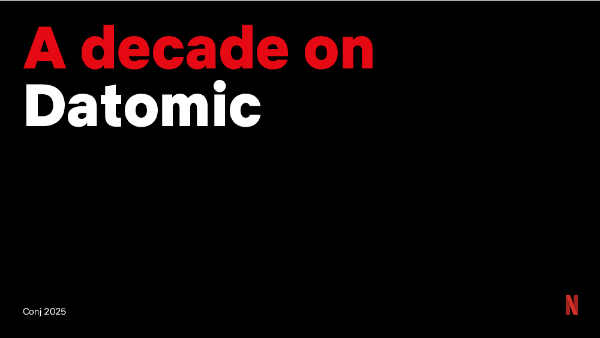

My name is David Shepard. This is Jonathan Indig. We are software engineers at Netflix. And today we're going to talk about a system that we work on built on Clojure and Datomic. And we hope to give you some insight into how this system makes use of Datomic in particular and how it has empowered the project's success over the last decade.

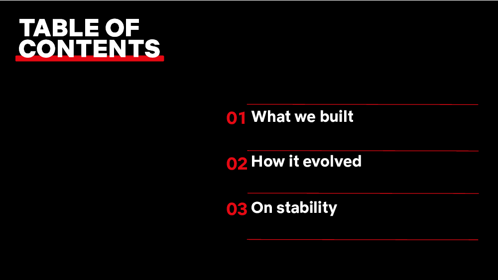

So we'll talk a little bit about kind of what it is, what we built, how it's evolved over the last 10 years, and then Jonathan's going to talk about how stability has been important to us as an organization and contrast that with how instability affects us.

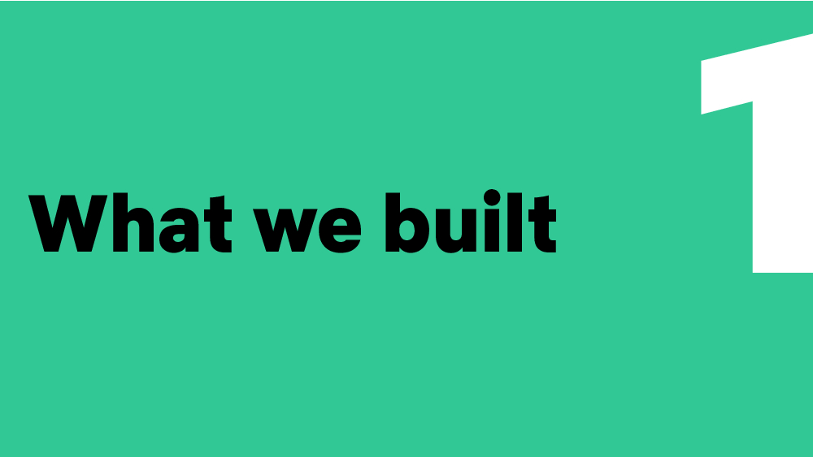

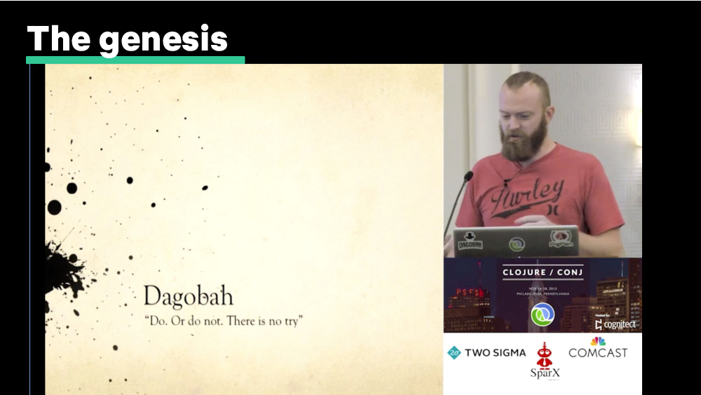

So, what do we build? This is not actually the first time we've introduced the system. Our dear friend and colleague Matt Bosenbrook gave a [talk at the Conj](https://www.youtube.com/watch?v=V2E1PdboYLk) almost 10 years ago to the day introducing this system: "Do. Or do not. There is no try." This was a system for for building data pipelines. And if you've not seen this talk I highly recommend you go watch it. Many of the core ideas that went into how we think about data pipelines and how we model them are still very much alive and well today. We've made many advancements over the last 10 years but the core ideas are still true to this day.

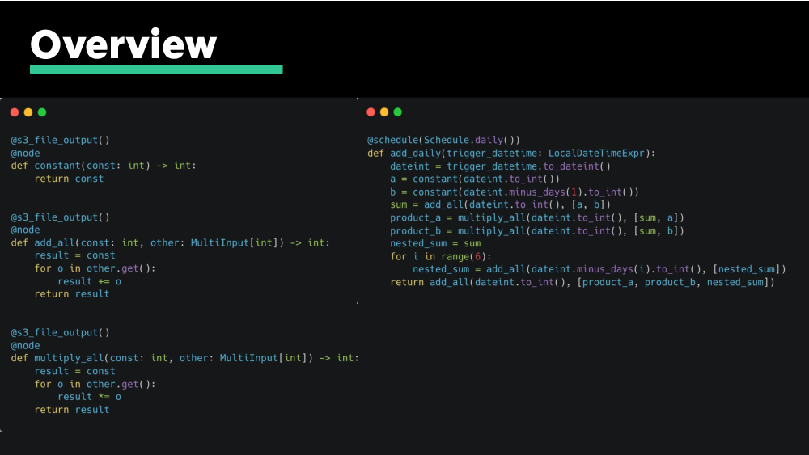

So what is it? It's for building data pipelines. And it's really for data scientists and researchers to define data in particular ML training pipelines. So we give them a simple Python API. No tomatoes, please. We got to meet them where they're at. But it essentially allows them to define these pure Python functions. They can decorate them. They compose these functions together. And we essentially take that call graph on the right and we translate it into EDN. We turn the date math into Clojure expressions that we can evaluate in SCI and that resultant payload is basically what we use to compute the underlying DAG. So we can take that example and run those in a distributed way on separate instances.

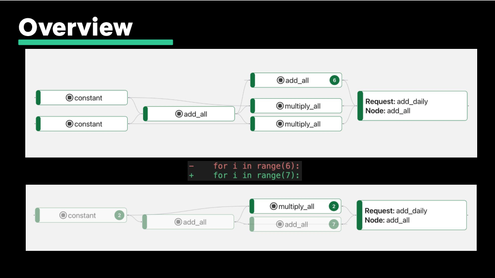

Now that's all well and good. Many orchestration systems can do this. It's not particularly interesting, but the feature that sort of sets Dagobah apart is that we have a very robust model to track data provenance. So we know the code and data that flows through every single one of these steps. And so we can actually do structural sharing. Like Clojure does with persistent data structures, we do that for data pipelines. So in the example above, you can make a structural change to the pipeline to sort of edit, let's say, the depth in which you wanted to recurse. And we can work out the part of the pipeline that actually we can totally reuse and skip and memoize and we only have to compute the necessary delta to materialize the new result that this researcher wants. Needless to say this is a huge productivity boost for researchers in Netflix. Two researchers working on the same pipeline will automatically share the common components. They're not restarting from scratch. You know these jobs you know they're not trivial things doing simple math in Python. These are like Spark jobs processing hundreds of terabytes of data taking hours or days to run. And so not having to do them is a big win not just for time but money saved for Netflix.

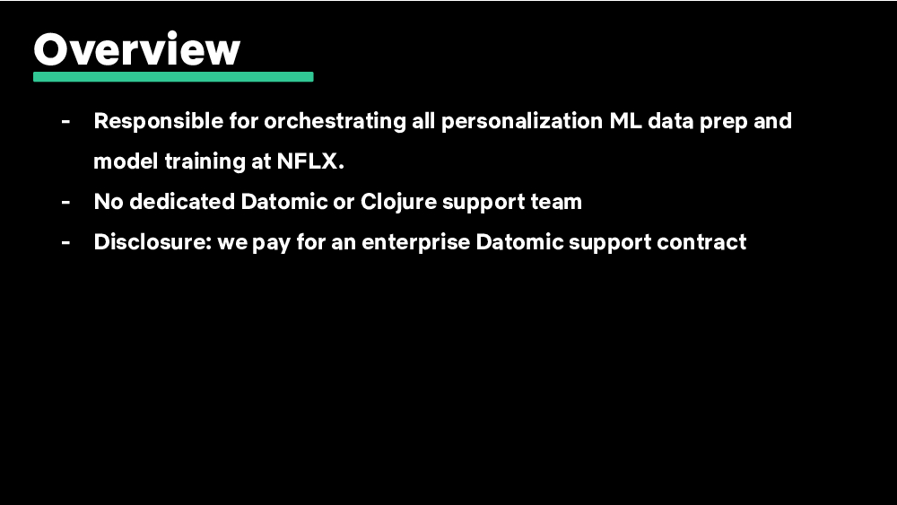
 
So this system is currently responsible for orchestrating all personalization ML data prep and model training at Netflix. We have no dedicated or Datomic or Clojure support team. I mean -- you're looking at them basically. We do however pay for an enterprise Datomic support contract. This is extremely critical infrastructure for Netflix and we do not want to go it alone. We take all the resources we can and we have a fantastic partners helping us do it.

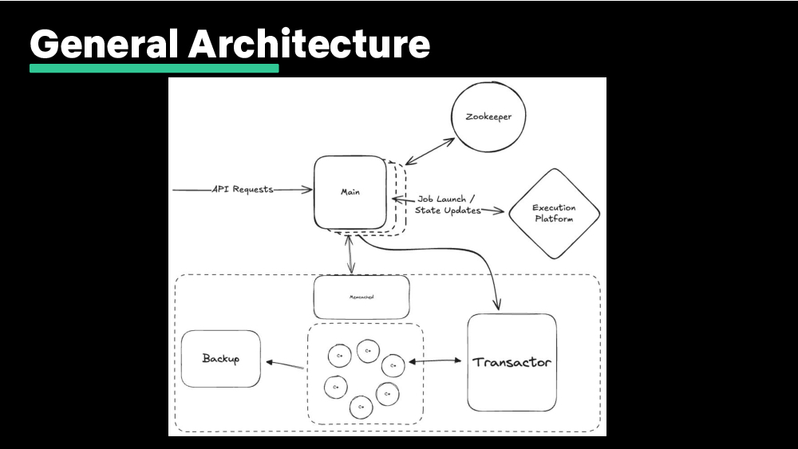 

So in the beginning Dagobah was built to support a single ML team right from its genesis. So early days the architecture was quite simple. It was deployed essentially as a monolith in an HA way using Zookeeper to manage leadership state and this one deployment would manage all aspects of the application: handling API requests, launching jobs on underlying compute systems, updating state and persisting that into Datomic. We deploy Datomic On-Prem backed by a Cassandra cluster with a shared memcached deployment as well and we run backups into S3.

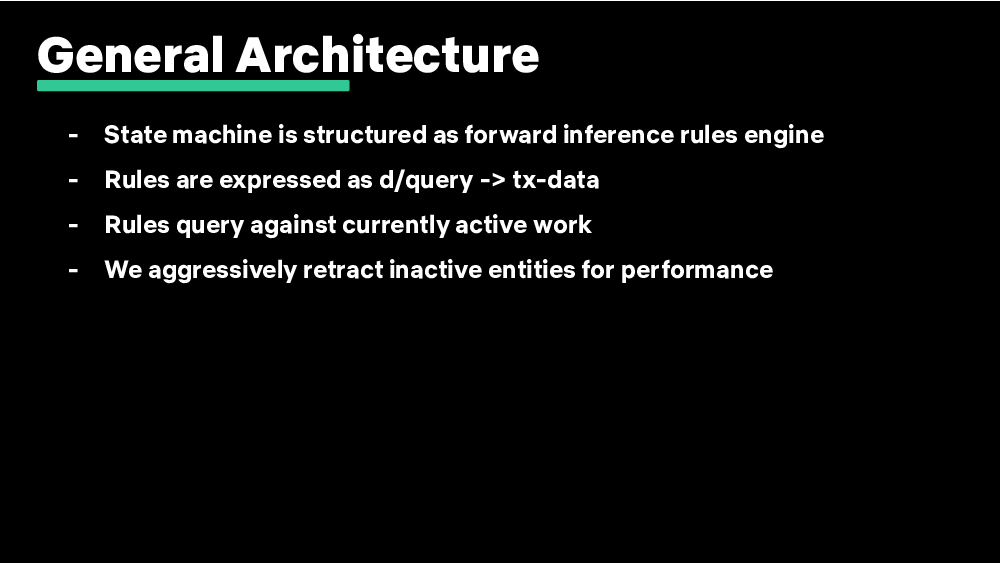 

Now there's a couple interesting properties of the the state machine that we maintain. It's actually written as a forward inference rules engine not too different from like Clara rules. Our rules are structured around essentially a Datomic query to a pure function that produces transaction data. We run those rules with the result onto a database and run that recursively until we reach a new stable state and say "given this novelty here is what we must persist" and we write that down.

Now these rules query against what we consider currently active work. So we need to look at what is currently transient in state. So we don't want to be considering you know finished executions from days or weeks ago. We just want to be looking at the current state of now. And the way we do that is we actually aggressively retract inactive entities for performance. So our asserted true database is basically what is currently running and what is retracted is sort of done in the past per se. So most API queries to look at history are actually looking at a history database in Datomic. An example of one of these rules might be "find all newly failed jobs and cancel their dependents".

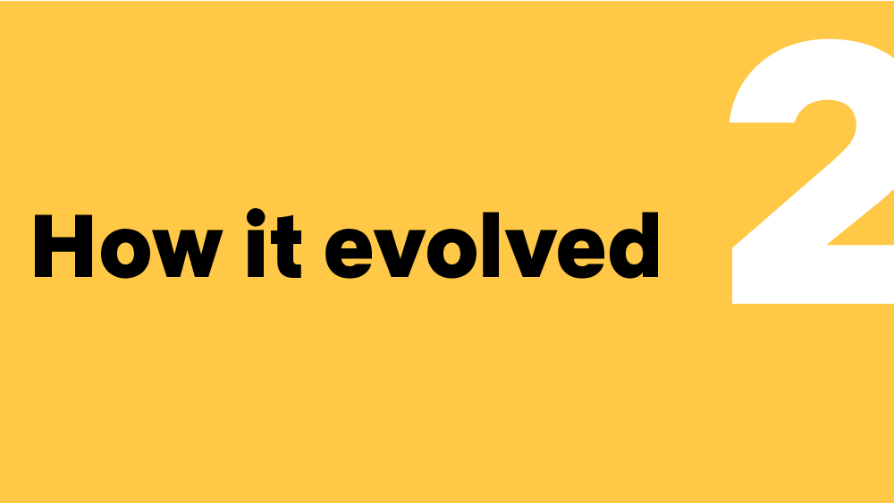 

Now needless to say the system has evolved a bit in the last 10 years. That architecture worked well to understand how to model the domain and to serve that one team but now it's used by dozens of teams training thousands of models and Netflix as a business has changed a lot in the last 10 years and so we've needed to evolve the application to keep up with these evolving needs.

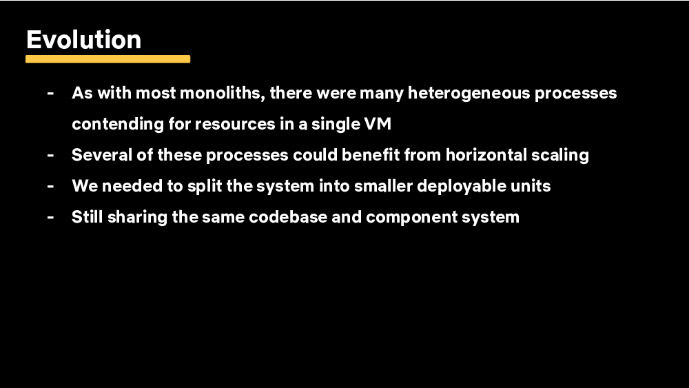 

Now, as with most monoliths we had a lot of new heterogeneous processes, all contending for resources in a single VM. Several of these benefited from horizontal scaling. So we knew we needed to start splitting the system into smaller deployable units to access more compute and to also improve overall efficiency of the system. But we still wanted to share the same codebase and component system. I think Netflix is known for going microservices but we were a small team. We didn't need to go full-on to have totally independent teams of microservices. We wanted one shared codebase and we just needed to be able to deploy the app in different what we called "stacks".

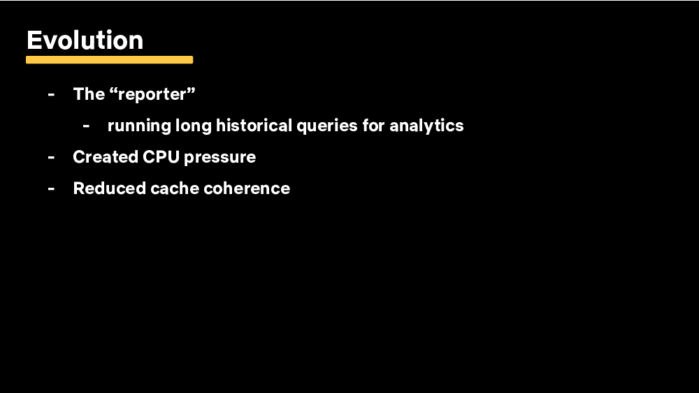 

So the first piece we wanted to tackle was the easiest. We needed to build our muscle in understanding how to split things out in this deployment architecture with Datomic. So we didn't want to have to solve additional distributed systems problems. We just wanted to understand the mechanics of doing the separation and understand whether our understanding of the performance we would get was actually true. So the first one we tackled was a component called the reporter. Its job is basically to run long historical queries to emit information to a time series database central to Netflix. We use it for like dashboarding and alerting. And it was basically running these sort of standard queries on a regular period. But these queries were creating increasing CPU pressure as the usage was going up. It was also reducing cache coherence. So you have these rules running against things that have happened seconds or hours ago competing with cache space from things that are looking from a week ago.

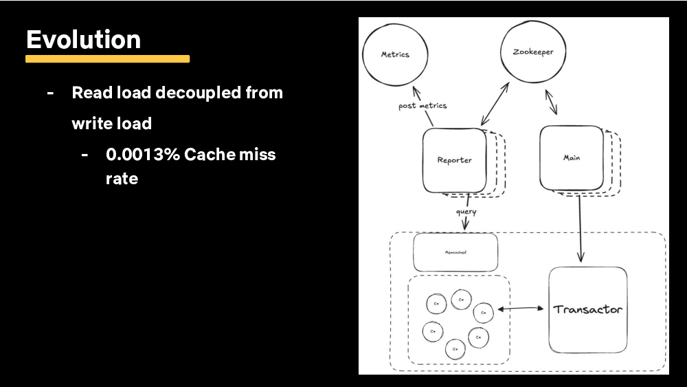 

It was a relatively simple split. We deployed it in a similar HA way. And it basically had no need to talk back to the direct application. So it was a fairly straightforward split and it could function as a stand-alone peer and query Datomic directly. But we needed to make sure that read load was decoupled from write load. This was the fundamental assumption we wanted to verify. With most databases you need to spin up like read replicas otherwise you're still competing with resources on your primary write master. But because these queries are so regular and the peer has a built-in object cache the cache miss rate on this is 0.0013%. So virtually no queries are actually touching underlying storage. So this effectively functions as a total island that we can scale totally independently from the rest of our application. We just don't have to think about it. Which is fantastic. It was a very straightforward approach and we got exactly the result we had hoped for.

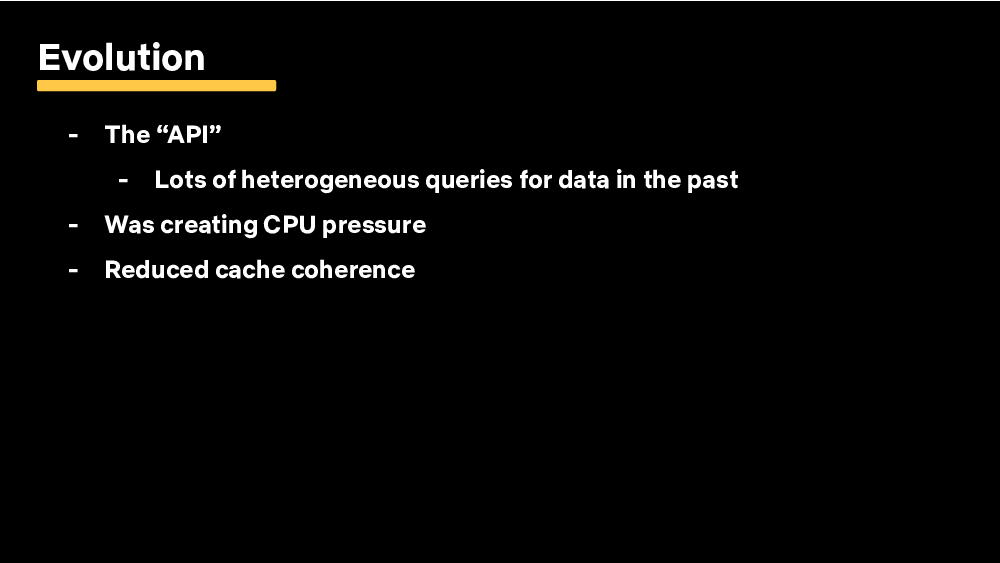 

So that gave us confidence to move on to the next portion that we wanted to actually horizontally scale. The obvious thing there is all your read APIs. These are all stateless queries. They don't update any state. We can serve those and scale as needed. So the API component as it were. But you know it wasn't as regular. It wasn't homogeneous queries. There's lots of heterogeneous things. Users want to see their graphs that are currently running. They want to run timeline queries to understand the state of things from weeks or months ago. And so it wasn't obvious that necessarily we'd get the same sort of performance trade-off that we would with splitting out the reporter. But it still had these same problems. We were getting CPU pressure and memory cache coherence problems for the exact same reasons.

 

So here we had to spin up a horizontally scalable pool of API instances but now we had to mediate our read and write traffic. So we would still forward writes to our sort of main application and then just handle the reads directly from within the API instances. So in this case we still need to verify, okay, is our read still truly decoupled from our write load? Because these queries look very different than a very standard fixed query running on a cadence. And even in this scenario with different queries from all the different customers spread across all these instances, the cache miss rate is still 0.02%. And so again, we're in a scenario where we can scale this horizontally and we effectively can totally isolate or buffer the load that would otherwise hit the shared resource that's shared with the critical write path.

But we had a new problem to solve which is now read after write consistency. Because reads are now happening on separate instances from where writes are happening. And [to] our clients, we don't want to expose this internal detail and say "hey you write this thing and you might not see the result". There's a slight lag between a write goes through and every peer sees it.

But Datomic has two lovely primitives to address this problem. The first is the `basis-t` value you get from transacting something – it's just a simple number, so it's easy to pass around in an HTTP header or in the response body. And then you can call `d/sync`: you pass this `t` value in on any peer you want and you are guaranteed to get a database at least up to date with that value. So we can just synchronize the API instance that forwarded the write, it can run all its resolvers against the state of the world that's guaranteed to have seen that write. And we can forward the `basis-t` down to the client so all subsequent reads to different peers will still see the result of that write. And doing this is basically just a plumbing job, right? It's not like a hard distributed system. We just have to pass the information around and it just works.

 

The next scaling challenge was a little bit more interesting. And this had to do – I mentioned that we have to aggressively retract things that are no longer active, and we had to do this in a sort of an Datomic way. As soon as a graph is inactive we would atomically retract the whole piece. Now these transactions were occasionally getting, um, kind of large. And some detail on this are graphs are actually modeled as nested component entities. So you'd have like a root, it would have component-entity relationships with its dependencies and that would sort of occur recursively. And this was convenient because you could simply retract the root and the whole sort of connected graph would get retracted with it. But we were seeing that retracting these single graphs in one shot was starting to occupy a transactor for multiple seconds.

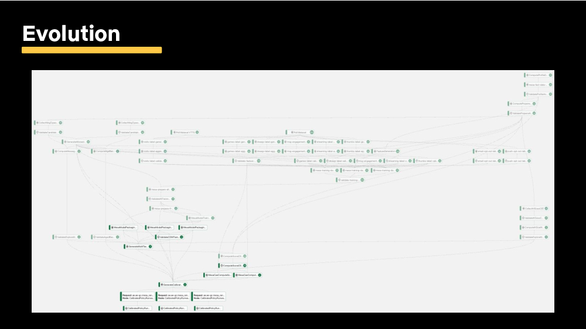 

And the reason is these graphs were getting a little bit big. So this here is is a representation of the DAG necessary to compute one re-training of a messaging model. So this is the model that predicts the best sort of message content, whether or not to send it on your your iOS device or as an email or something like this. Except this isn't the whole thing. I had to do some collapsing to fit it on the slide. It actually looks something like *this*.

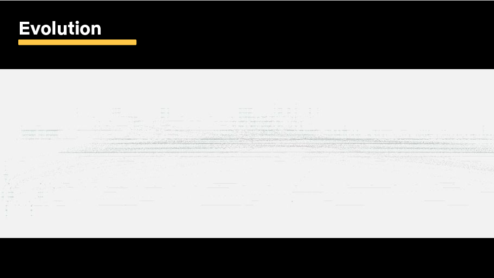 

And we were trying to retract multiple of these in a single transaction, because a shared upstream failure might affect multiple of these in one shot and we were trying to retract it all at once. Needless to say, this is not a great thing on any OLAP database to transact something that large, but we were doing it. And we needed to fix it because those long latencies were not great. We needed to address that.

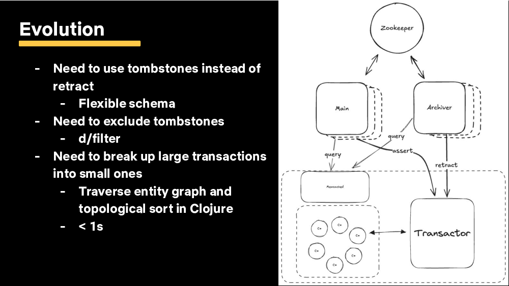 

So we did as we did before. We split up this archiver onto its own stack so we could isolate the resources it needed. But we also needed to move to tombstones, instead of retracting directly. Because when you retract an entity in Datomic, you're actually retracting all of its attributes separately. And so instead of retracting the entity, we just mark a tombstone boolean. But the beauty of the Datomic is schema is very flexible. So it's very easy to just add this new attribute and all the different entities in which we need to do this, we can just tack it on. Oh, and we can index it too. But now we need to exclude these tombstones, whereas before these entities were sort of implicitly excluded because they were no longer true. They were true but had this separate bit that we needed to exclude. But again Datomic had a tool [which] exactly fit our problem which is `d/filter`, right? We could simply query for all tombstone entities and simply filter it out so all our code would just see a database in which it looked like all these entities were gone. And that query was very efficient because it's a simple bit lookup that's on an indexed attribute.

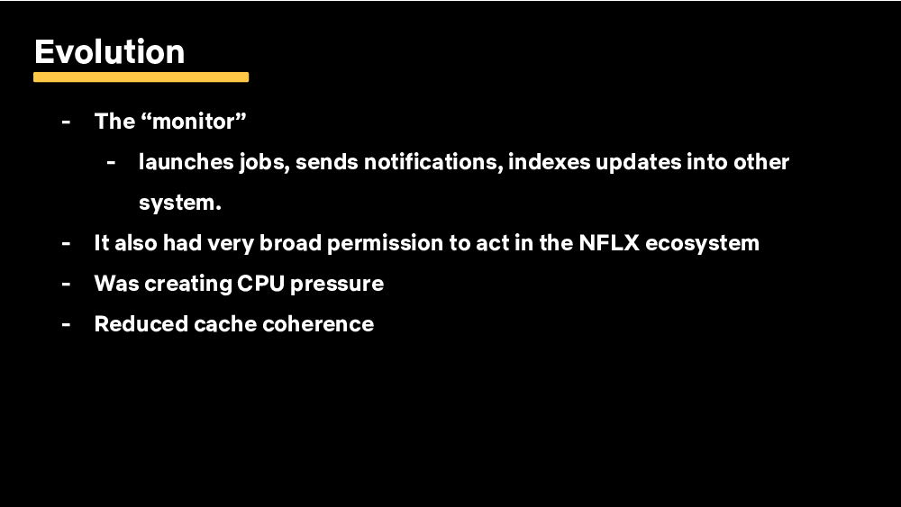 

But the next problem was, okay, we can filter them out, we can retract them asynchronously but we need to break them up into smaller chunks, right? We don't want to be retracting them all in one shot. So what we needed to be able to do was to take this graph, topologically sort it, and retract it from leaf to root. And you know in conventional graph databases you might have to write a complex query to do this deeply nested traversal. But we just get to fall back to the entity API and traverse it with regular Clojure code! We can just write your off-the-shelf topological sort. It just looks like I'm operating over a map. I can write generative tests for it, make sure it works, and ship it. Not only that, it's fast! That graph I showed has about a half a million nodes in it and we topologically sort it in less than a second. We query the database and we get a topologically sorted representation without doing anything fancy. Right? There was no manual optimization here. It's just sort of "do the obvious thing" and it works.

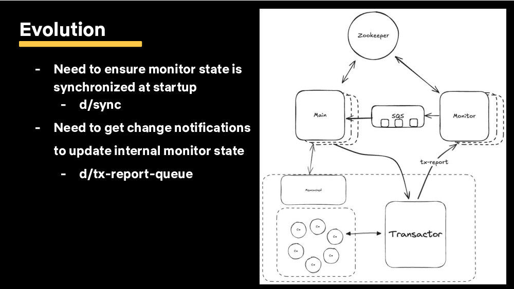 

And this led us to the most recent evolution. And this is a little bit more interesting because this is a case where we had to evolve because of a business need.

So, Netflix has most recently moved into ads. That's necessitated us handling PII data which means we need to be more mindful about security in the way we build our applications. And so we had to tackle a component called the monitor. Now this is basically the part of the application that handles all the effects we need to carry out. So this is launching jobs, sending emails, cancelling things, sending notifications, indexing in other systems. By necessity this had very broad permissions in the Netflix ecosystem. It needed to carry out a bunch of stuff on behalf of other people and other systems. So it was getting increasingly elevated permissions to access lots of things. And this was collocated with the system that is running those I mentioned earlier. We have these small Clojure snippets. They're doing date math, but to a security researcher that's untrusted user code. They get a little jumpy when you're running that in an environment with elevated permissions. We were also seeing issues with CPU pressure and cache coherence. But ultimately this was a requirement of the business. We needed to separate this out in order to isolate untrusted user code evaluation from this component that needed this elevated access. And this was the most complex because this is the first one where we have this kind of bi-directional communication going on. So it needs pull jobs for updates, but those updates need to flow back into the main application stack to let it know about a state change or ACKing some cancellation or index back.

And so we had a number of problems we needed to solve. The first was how do we ensure this monitor state is synchronized at startup, right? Before, it was co-located with the application and it could just participate in its very ordered deterministic startup and we guarantee we had a nice up-to-date correct state. But now it can fail independently, it'll get deployed separately, and so its life cycle is no longer coupled together. So we need to figure out how to ensure that its initial state doesn't include things that we've already done in the past. But again, we had `d/sync` to the rescue. There's a version of it where you don't have the `basis-t`. Instead, you implicitly are synchronizing as-of this instant in time. You handshake with the transactor to guarantee that you have a database up-to-date as of *right now*. And that enables you to do things like observe things occurring in other systems until you decide, okay, I'm ready to get the state of the world. And so what we do is we synchronize with AWS's API. We await the queue being drained and then we call `sync` and we know we are up to date with all outstanding events having been processed and we can start in a clean state.

But now we also need to get change notifications, right? Before we were collocated in the same VM, it was very trivial to sort of send events and say, "hey I've got a new job to launch, update your internal state about it". So how do we do that? We need to do either event sourcing from the app or some sort of polling...but again we could just reach into the Datomic toolbox and we have the [`tx-report-queue`](https://docs.datomic.com/transactions/transaction-processing.html#monitoring-transactions), which gives us a nice lovely stream of every transaction flowing through the system, with the database values associated with it. We can basically tap into that and the internal state-updating logic remains basically identical, just using a new event source.

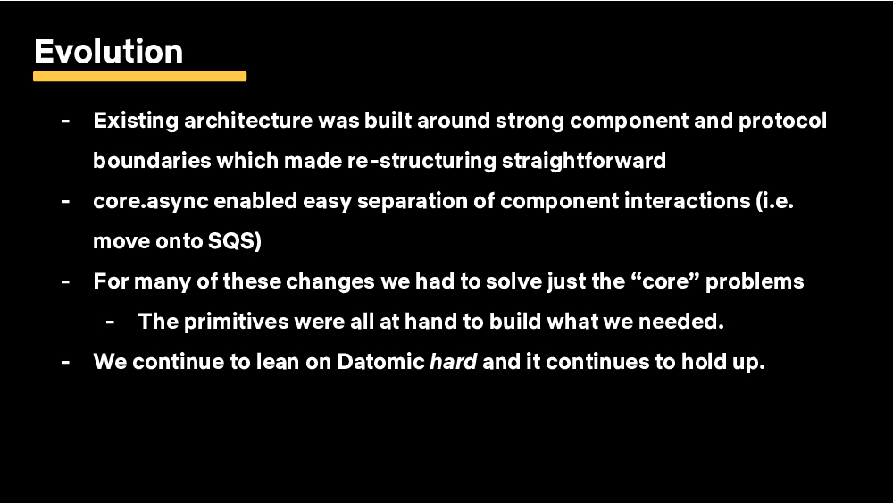 

Now through all these changes I want to give some credit to Matt. The existing architecture was built around a really strong component and protocol boundaries. There was a lot of thought that went into separating thinking about mutating state. Not only that, [but also] making the state-update process a pure function --- and again Datomic enabled this, because we can treat the database as a value. So computing the next state is a pure function that we can test very robustly, you know, separating that from all the effects that we have to carry out. And so it was very easy to take these subcomponents of the system and move them around in a logical way without having to re-think about how they actually function internally. And `core.async` was a big part of this as well. Many of these components were communicating over `core.async`. So sticking an SQS queue between them, they're sort of unaware. You just have to deal with the ordering problem and you're kind of done.

And you know I want to point out for many of these, we just had to solve the core distributed system problem from a design level -- like how do we need to make sure that this is correct after this change. But all the primitives were at hand to solve them. We didn't have to go and reinvent these things or try to work around the limitations of these tools. We had very, very good tools with very obvious semantics that we could reach to -- the definition of easy -- to go and solve these problems.

And we continue to lean on Datomic very hard. And it continues to hold up. We definitely abuse it. We store things in there we probably shouldn't and are working to not, but it continues to hold up and be an extremely robust part of our infrastructure.

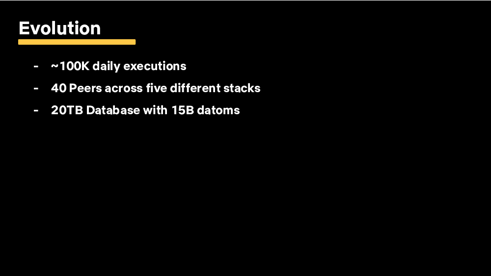 

I'd be remiss to not share some numbers. So, we run a out 100,000 daily executions. This is in service of thousands of models getting retrained hourly or daily. The application itself is about 40 peers at the moment across five different stacks. And our database is about 20 terabytes with 15 billion datoms in it. Growing every day.

 

And with that I'm going to hand over to Jonathan who's going to talk about the stability and how that's mattered to us as a team and contrast that with other parts of our ecosystem.

Thanks Davis.

[applause]

 

So as we all know and we've kind of talked about at Conj here the Clojure ecosystem is unusually stable. And that's a testament to the hard work of the Clojure and Datomic teams and all of you in the Clojure community. And we wanted to take a few minutes to articulate how this stability has mattered to us in a very real way by comparing it with some actual examples of the way software breakages in *other* ecosystems have been very disruptive to our organization over time.

So if we go back to Matt's talk from Conj 2015, he said "no one technology solves all problems". And you know that's definitely true. But even with all the changes to Dagobah that Davis just described, our underlying stack has remained pretty much the same: written in Clojure, using libraries such as Component, Plumatic schema, ring, and many others, backed by Datomic, running on Cassandra. However the ecosystem around Dagobah -- the data engineering and ML code that our users write, the internal runtime we have to integrate with and other enterprise tooling just around -- has changed quite a bit over the past 10 years.

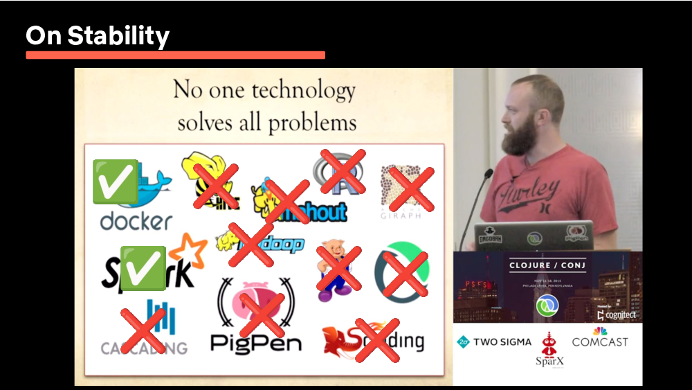 

If we look at this slide again and we think "what's in use today aside from Docker and Spark?", this is all gone. And to be fair, I don't think all the technologies on that slide were really in use to the same level. But we can talk a little bit about how things have changed.

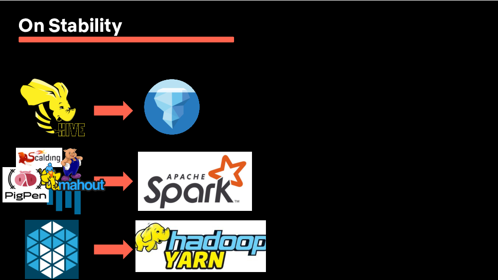 

So we've moved from Hive to Iceberg, from the kind of Hadoop ETL ecosystem like Pig and and those to Spark, and from Spark running on Misos to Spark running on Yarn. And lately we've also seen some movement from kind of Scala Spark to Pyspark, DBT with SQL, Metaflow and all these other Python world of ML.

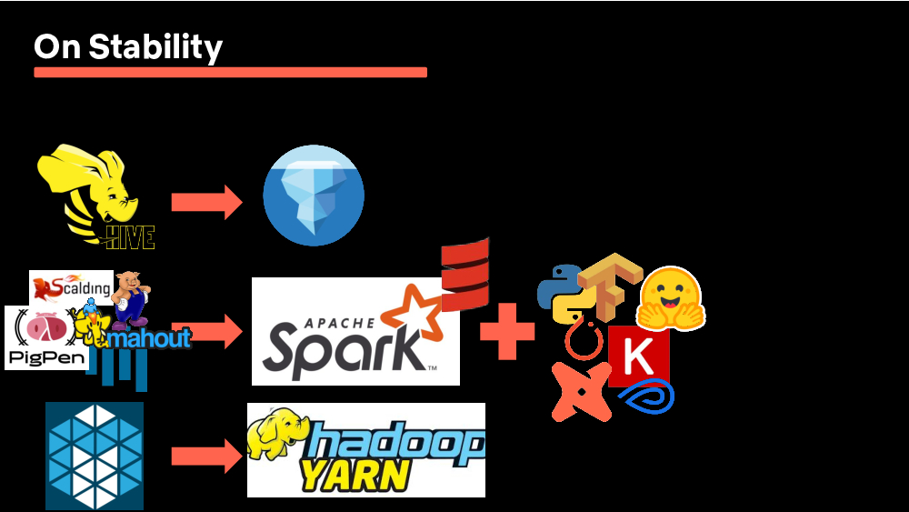 

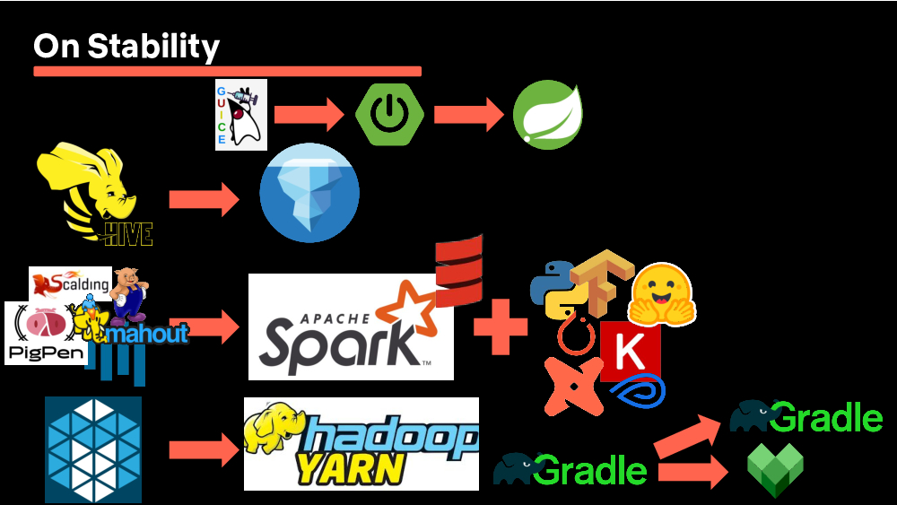 

And it's not just the data engineering and ML ecosystem that's changed. The Java
runtime that we use in order to integrate with other services at Netflix has
moved from Google Guice to Spring 2 to Spring 3. Some of our users moved from
Gradle to Basil, which matters to us because we integrate with their build
system. Some of them are still using Gradle so we just have to support both now. 

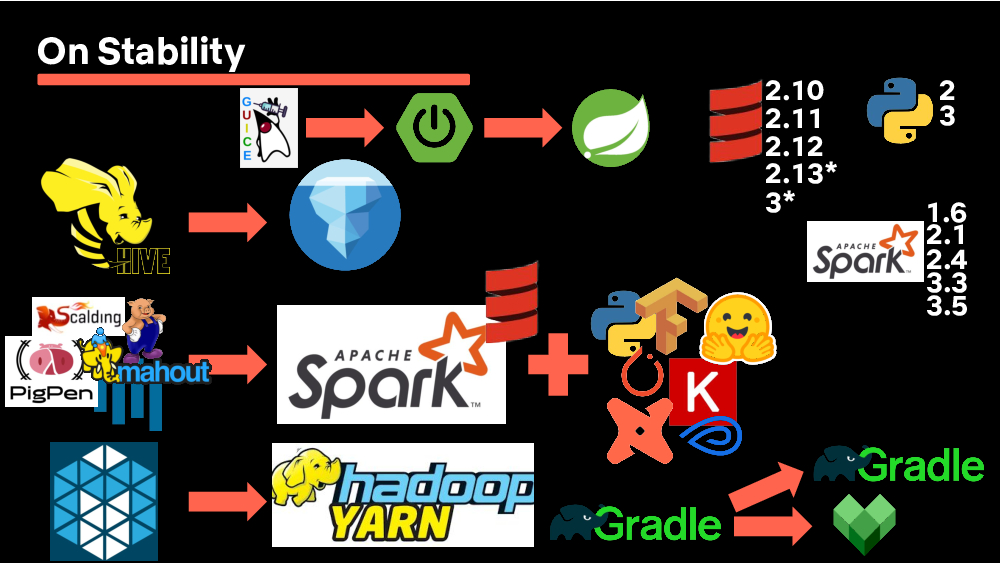 

And it's not just tech adoption. There's also version upgrades. So, Scala: there have been five versions in the past 10 years that we've had to deal with. The famous Python 2 to Python 3 upgrade has happened during that time. And you know Spark has also changed its version. And these are all breaking changes!

And, you know, some of this has happened organically. Technology changes, people use new tools, things come out, right? LLMs are a thing now, they weren't 10 years ago. The landscape evolves and that's I'm not saying that's bad.

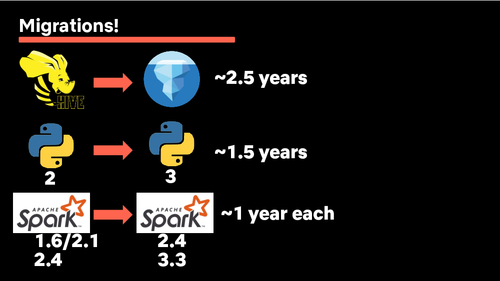 

But a lot of the time these changes involve migrations and especially if you're like us, you're a platform team. Just to kind of call out three of these. The Hive to Iceberg migration took about two and a half years. That was a doozy because it involved a lot of data rather than just code. Python 2 to 3 took about a year and a half. And then Spark 1 to 2 and 2 to 3 each took about a year. I was told "this is a year of concerted effort" -- as in data platform team pretty much stopped the world, paused all work, got that migration over the line. So that's a huge business impact, right?

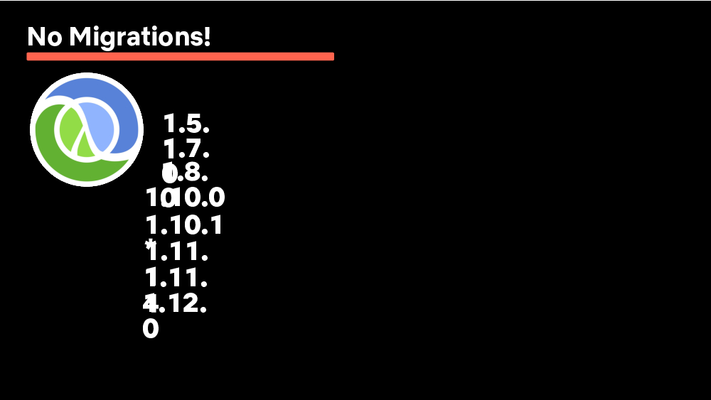 

We can contrast this a little bit with Clojure. So you know over the past 10 years we've upgraded the version of Clojure that we're using. We've upgraded it seven times. And you know, these upgrades, we didn't have to change any of our source code. There were no deprecated symbols, missing features, things that were renamed for no reason. You know, in fact, every update was as simple as, you know, "bump the version string in your build file, run CI...okay, great. We're done. That's it." [cheering]

So, except...there's a little asterisk there. So when we when we upgraded to 1.10.1 we noticed that there was a perf regression. So we just popped right back down and moved on with our day. And when 1.11 came out we were like "oh let's try and see what happens". And we upgraded and the perf issue wasn't there. So we said, "great, no problem, let's upgrade and move on". It was just so easy to change the version because nothing else had to change. So, we didn't have to troubleshoot that. We didn't have to, like, figure out what was going on, what changed. It just literally didn't matter. And that's amazing. What else does that?

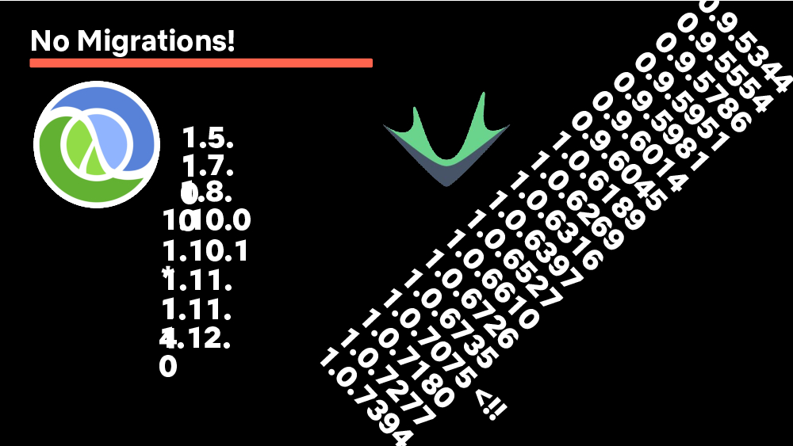 

And we've also updated Datomic. That's, you know, another thing that does that actually. We've updated quite a bit. Most of these upgrades were, again, as simple as upgrading the version in our build and -- ha, I think, Jaret knows what I'm going to say in a little bit -- upgrading the version in our build and running CI. And that's pretty much it. We did have a couple changes that were a little bit more work though. The first one, so if you noticed that blocking take symbol next to 7075. So that upgrade actually had a `core.async` usage change on the Datomic side which ended up causing our code to deadlock, but that was because we were bad. We had some blocking calls in our `go` blocks. And that's not a good thing. Sorry, Jaret. Lesson learned: Do not do entity attribute lookups in your `go` blocks and you'll be fine. So, now we have a big comment, "Got to have a blocking!", you know.

Second, we made two Cassandra protocol upgrades over the years. One from cas to cas 2 and one from cas 2 to cas 3. The migration from cas to cas 2 was in order to take advantage of segment chunking. And you know since that changed the way the data gets stored at rest, we had to undergo downtime to migrate the database via Datomic's backup and restore feature. But, you know, it worked great. No big deal. Take a little bit of downtime, we're up and running. And luckily we didn't have to do that for cas 2 to cas 3. That one was mostly because we needed an upgrade of the data stacks driver that talks to Cassandra. Which is actually something we needed to ask the Datomic team for because we needed it to migrate from spring 2 to spring 3. [laughter] So yes, thank you to the team for upgrading that driver after all of our badgering.

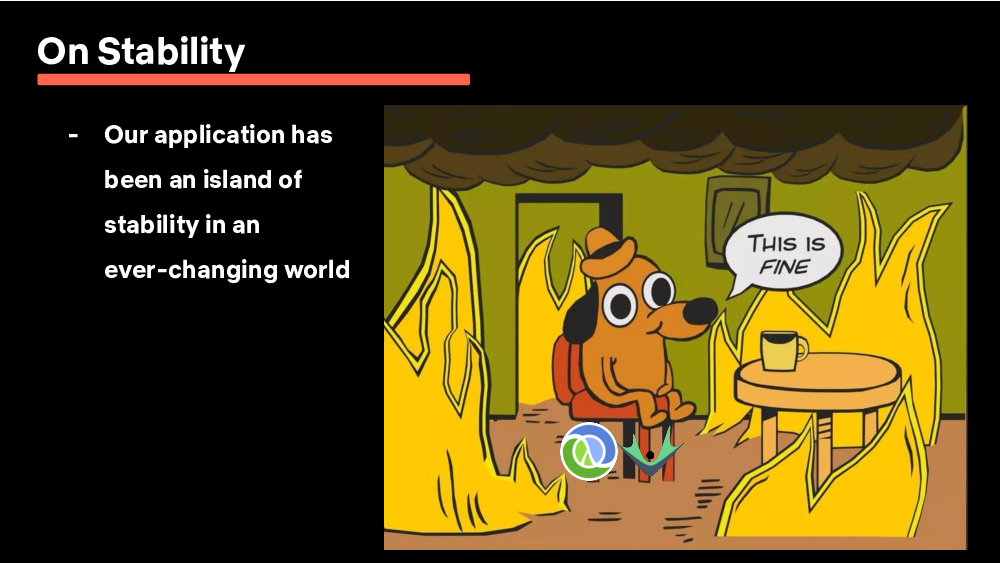 

Hopefully at this point the contrast is clear. While we've had to make changes around the edges of Dagobah to support these migrations that I mentioned -- you know, user code migrations, other things like that -- the Clojure and the Datomic core that we run on has been remarkably stable. In fact we kind of feel like this dog but like, unironically. We're fine! We like our little chair there. I mean, everything else looks like that, but we're good right here in the middle. [applause]

Now I'll hand it back over to Davis to close us out.

Jonathan and I, we get to stand up here and talk, but there's a lot of people that have put in a ton of effort to make this possible.

 

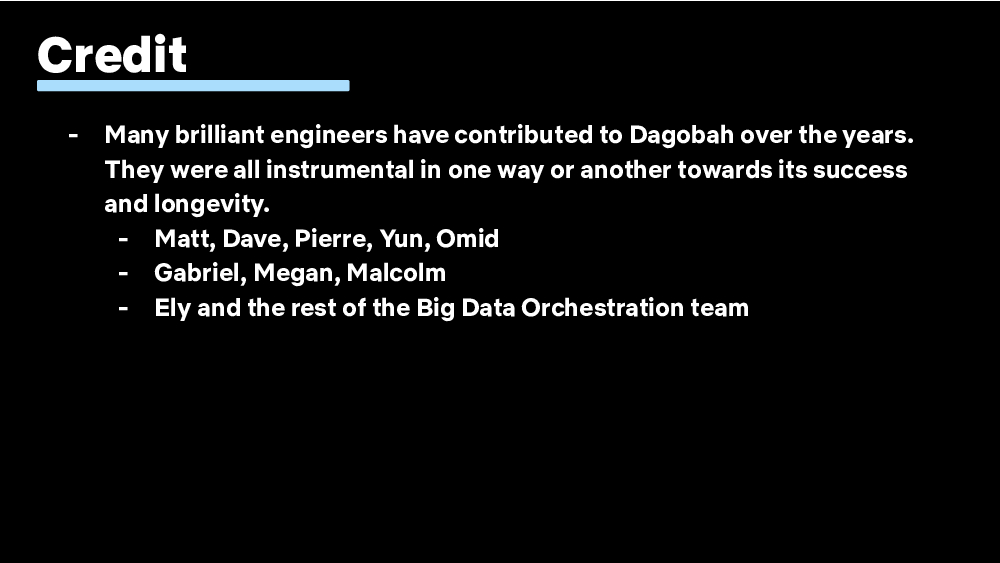 

Many brilliant engineers have contributed to Dagobah over the years in one way or another. Matt, who I mentioned, and Dave, the progenitors of this project. Our former colleagues, Pierre, Yun, and Omid, and our current wonderful team, Gabriel, Megan, and Malcolm, and of course, our boss and the whole big data orchestration team have been instrumental in helping this project be a success.

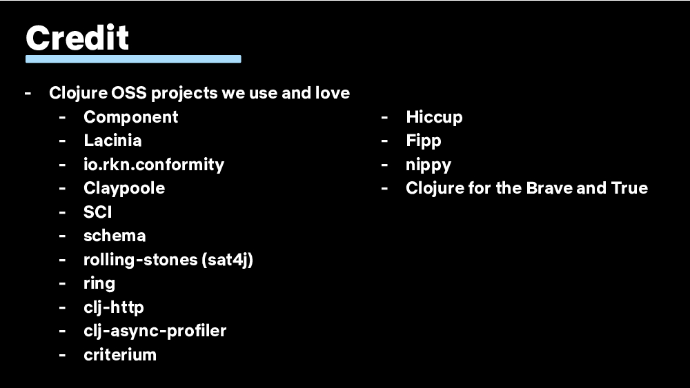 

But also to the Clojure open source community. We have access to world-class extremely stable tools to solve all the problems we need. Component for managing application life cycle. Lacinia for building our GraphQL API, Conformity for managing database migrations, Claypoole for thread management, wonderful SCI projects for our sort of tight little sandbox, Schema to help us understand the data flowing around, Rolling Stones for having the best library name ever. (But you know, SAT solvers are fantastic. And we need them. It's a very important part of the project.) Ring, clj-http, these are all familiar names. We use the clj-async-profiler and Criterium all the time to understand how to make our application faster. Hiccup and fipp for presenting data. And then Nippy, you know, just an incredible serialization library. We use it extensively for hashing internally.

And then finally, shout out to Clojure for the Brave and True. This has been our go-to resource for helping to onboard new folks who show up in our codebase and have no idea how to read it. As opposed to intimidating them with a big book, we can give them this fun little story to go and explore and they have a lot of fun. It's been a really wonderful way to bring people on board.

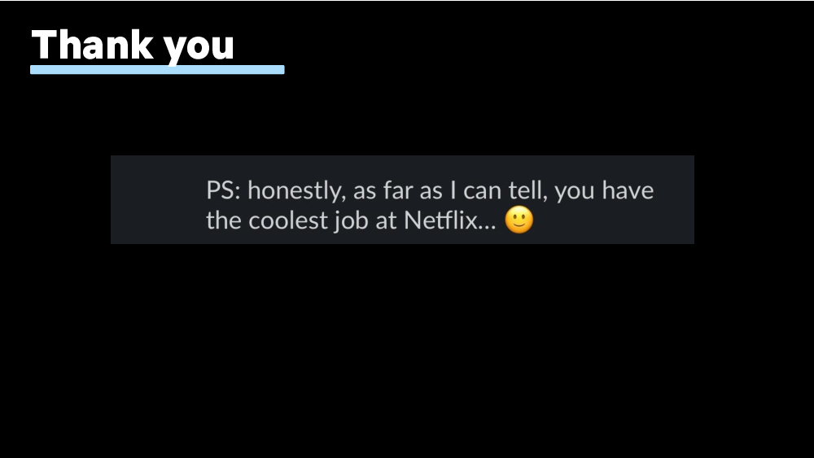 

To close, I just want to say again, thank you. At the risk of sounding vain, I'm going to share my favorite compliment I received while working on this project. And I want to share it because I think it's owed to the whole community, which is this. Now there's a lot of cool jobs in Netflix, but I really like my job. I get to solve some very cool problems. We get to solve some cool problems. And reflecting on, why is it that I get to solve cool problems?  Why do I find myself in this position? It's because I get to use tools that I'm unencumbered by. They get out of the way. They have very predictable properties. They have very good semantics and they don't break. I just get to get down to the business of solving very important, critical, fascinating problems for the business and use world-class tools to do it, that stay out of my way. And so thank you to this whole community. Thank you to the Datomic team. Thank you to Rich. Thank you for letting us have the coolest job at Netflix. Thank you.

 
